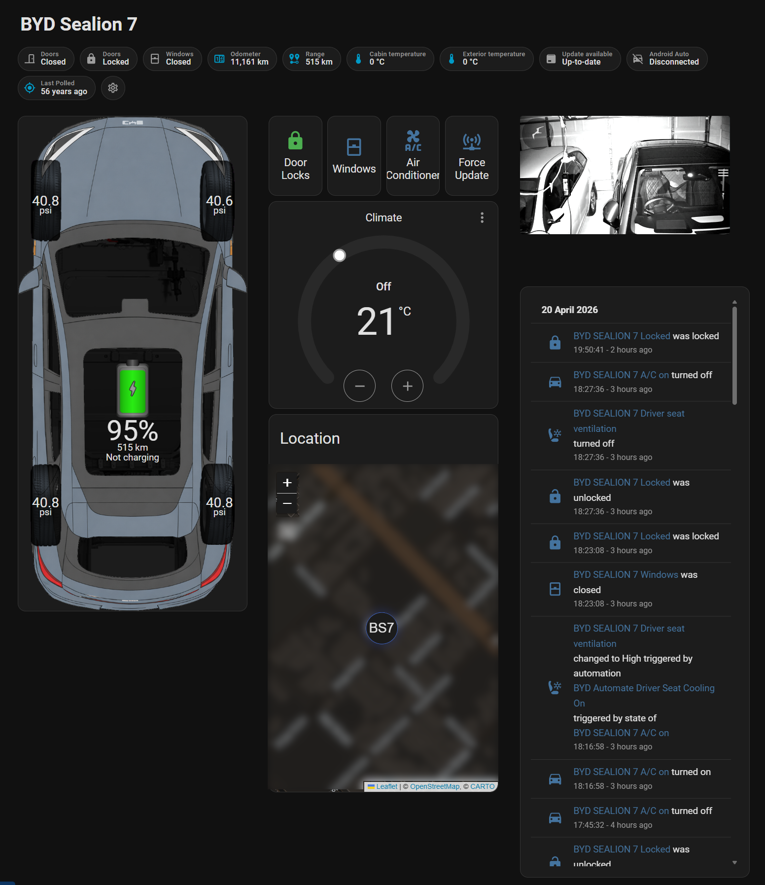

# BYD Sealion 7 — Home Assistant Dashboard

A visual Home Assistant dashboard for the BYD Sealion 7, featuring an interactive car graphic with live tyre pressure indicators, battery level display, door lock and window status overlays, climate control, live location map, and seat automation helpers.



---

## Features

- Layered car graphic with conditional overlays for tyre pressure warnings, door locks, and open windows
- Two battery display styles (Type 1: full-width graphic, Type 2: small icon)
- Animated charging bolt indicator
- Live tyre pressure readouts for all four corners with high/low alerts
- Seat heating and ventilation automation toggles
- Climate control thermostat card
- Live GPS map
- Garage camera feed via Frigate (optional)
- Auto-poll on dashboard load via Browser Mod
- Auto-poll on Android Auto connection (optional)

---

## Prerequisites

Install the following before proceeding. All HACS items require [HACS](https://hacs.xyz/) to be installed first.

| Requirement | Type | Notes |
|---|---|---|
| [BYD Vehicle Integration for Home Assistant]([https://github.com/danieldotnl/ha-byd-ev](https://github.com/jkaberg/hass-byd-vehicle)) | HACS Integration | Provides all `sensor.byd_sealion_7_*` entities |
| [Browser Mod](https://github.com/thomasloven/hass-browser_mod) | HACS Integration | Required for auto-poll on dashboard page load |
| Local Media | Built-in HA integration | Must be enabled — check Settings → Integrations |

---

## Installation

### Step 1 — Copy Images

Copy the contents of the `images/` folder from this repo into your Home Assistant media folder:
/media/BYD/
All 55 image and GIF files must be present for the dashboard overlays to display correctly.

> **Note:** This uses HA's Local Media source (`media-source://media_source/local/BYD/`), not the `www` folder. Make sure the Local Media integration is enabled in Settings → Integrations.

---

### Step 2 — Add Configuration to `configuration.yaml`

Add the following to your `configuration.yaml` file.

> **Important:** The sensor entity names in the `state:` lines (e.g. `sensor.byd_sealion_7_battery_level`) are generated by the BYD Vehicle integration based on the name you gave your vehicle during setup. If your vehicle was named differently, these entity IDs will differ. Check Settings → Devices & Services → BYD Vehicle to confirm your entity names and adjust accordingly. 


```yaml
template:
  - sensor:
      - name: "BYD Battery 5 Increment"
        state: "{{ (states('sensor.byd_sealion_7_battery_level') | float(0) / 5) | int * 5 }}"
      - name: "BYD Front Left Tire Pressure Display"
        state: "{{ states('sensor.byd_sealion_7_front_left_tire_pressure') | float(0) | round(1) }}"
      - name: "BYD Front Right Tire Pressure Display"
        state: "{{ states('sensor.byd_sealion_7_front_right_tire_pressure') | float(0) | round(1) }}"
      - name: "BYD Rear Left Tire Pressure Display"
        state: "{{ states('sensor.byd_sealion_7_rear_left_tire_pressure') | float(0) | round(1) }}"
      - name: "BYD Rear Right Tire Pressure Display"
        state: "{{ states('sensor.byd_sealion_7_rear_right_tire_pressure') | float(0) | round(1) }}"

input_boolean:
  body_above_wheelbase:
    name: Body on Top
  show_tyres:
    name: Show Tyres
  byd_config:
    name: BYD Config
  byd_driver_seat_cooling:
    name: Driver Seat Cooling
  byd_driver_seat_heating:
    name: Driver Seat Heating
  byd_passenger_seat_cooling:
    name: Passenger Seat Cooling
  byd_passenger_seat_heating:
    name: Passenger Seat Heating

input_select:
  battery_display_option:
    name: Battery Display Option
    options:
      - Battery Type 1
      - Battery Type 2
    initial: Battery Type 1
```

After saving, reload your configuration: Developer Tools → YAML → Reload All YAML Configuration.

---

### Step 3 — Add the Automations

Import the automations from `automations.yaml` by copying the contents into your existing `automations.yaml`, or importing them one at a time via Settings → Automations → Import.

> **Before importing, read the notes below — several automations require personalisation.**

#### Automations requiring personalisation

**BYD Force Poll when Pixel 9 Pro connects to car** and **Disable Polling**

These trigger polling when a phone connects/disconnects from Android Auto. They contain device-specific IDs unique to the original installation. You will need to:
1. Delete the first action step in each automation (which references a specific switch device by internal ID)
2. Substitute your own phone's binary sensor for `binary_sensor.pixel_9_pro_fold_android_auto`
3. Optionally remove these automations entirely if you don't use Android Auto

**Page Load Poll**

Uses a webhook to trigger a force poll when the car dashboard page loads (requires Browser Mod). The webhook ID in the file is unique to the original installation — after importing, open the automation, regenerate the webhook ID, and update your Browser Mod configuration to match.

#### Automations that work as-is

These require no changes beyond ensuring your entity names match:
- BYD Automate Driver Seat Cooling On
- BYD Automate Driver Seat Heating On
- BYD Automate Passenger Seat Cooling On
- BYD Automate Poll on Page Load using Browser_Mod
- BYD Cooling On Pressed
- BYD Driver Seat Heating Pressed
- BYD Passenger Seat Cooling Pressed
- BYD Passenger Seat Heating Pressed

---

### Step 4 — Create the Dashboard

1. Go to Settings → Dashboards → Add Dashboard
2. Give it a name (e.g. "Car") and set the URL path to `car`
3. Open the new dashboard → three-dot menu → Edit → Raw configuration editor
4. Paste the contents of `car.yaml`
5. Save

---

### Step 5 — Personalise the Dashboard

**Garage camera** — Replace `camera.garage` in the Frigate card with your own camera entity, or remove the card entirely:
```yaml
- type: custom:frigate-card
  cameras:
    - camera_entity: camera.garage  # ← replace with your camera entity
```

**Android Auto badge** — Replace or remove `binary_sensor.pixel_9_pro_fold_android_auto` in the badges section.

**Sensor entity names** — If your BYD vehicle was named differently during integration setup, all `sensor.byd_sealion_7_*` references in `car.yaml` will need updating. Use find-and-replace on `byd_sealion_7` to substitute your own prefix throughout the file.

---

## Tyre Pressure Thresholds

Warning overlays trigger when any tyre falls below **38 PSI** or rises above **44 PSI**. Adjust the `below` and `above` values in the eight tyre pressure conditional blocks in `car.yaml` if your preferred range differs.

---

## Battery Display Modes

Toggle between two battery display styles using the `Battery Display Option` input select (accessible via the config panel):

- **Battery Type 1** — Full-width battery graphic overlaid on the car body
- **Battery Type 2** — Small battery icon positioned centrally on the car graphic

---

## Config Panel

A hidden config panel is controlled by `input_boolean.byd_config`. Tap the gear icon badge in the dashboard header to toggle it. When enabled it reveals body/tyre layer toggles, the battery display selector, a polling disable switch, polling logbook, and seat automation toggles.

---

## Repository Structure

```
byd-sealion7-ha-dashboard/
├── README.md
├── car.yaml              # Dashboard YAML
├── automations.yaml      # All automations
├── configuration.yaml    # Template sensors, input booleans, input select
└── images/               # All 55 PNG and GIF overlay files
```
---

## Credits

Built for the BYD Sealion 7 using the [BYD Vehicle Integration for Home Assistant]([https://github.com/danieldotnl/ha-byd-ev](https://github.com/jkaberg/hass-byd-vehicle)) custom integration. Tested on Home Assistant 2025.x.
